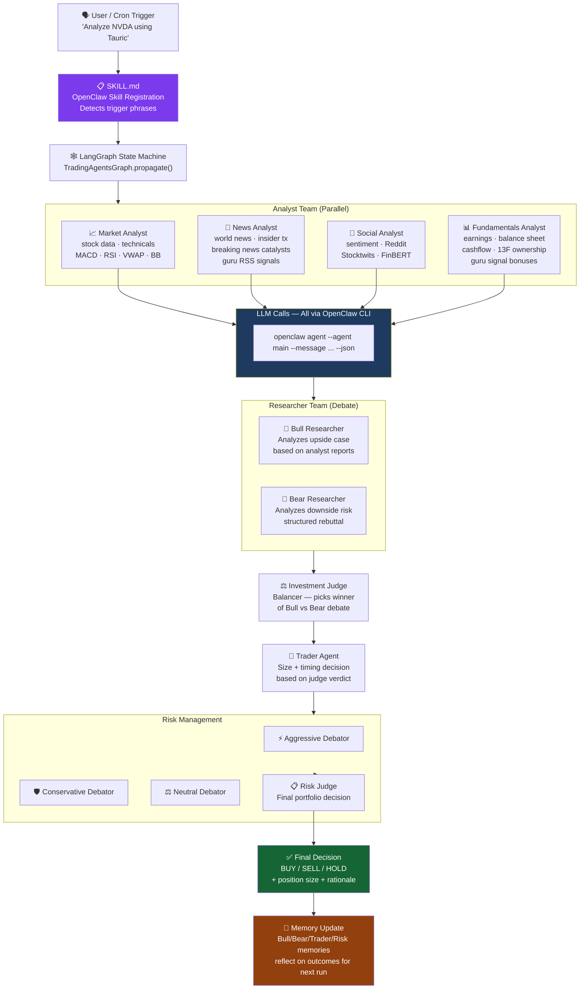

<p align="center">
  
</p>

<div align="center">

[](https://github.com/TauricResearch/TradingAgents)
[](https://openclaw.ai)
[](https://python.org)
[](https://github.com/langchain-ai/langgraph)
[](https://arxiv.org/abs/2412.20138)

</div>

---

# TauricResearch-Skill — OpenClaw Skill

> **Forked from [TauricResearch/TradingAgents](https://github.com/TauricResearch/TradingAgents)**  
> This repository adapts the original multi-agent LLM trading framework as a native **OpenClaw Skill**, routing all LLM inference through the OpenClaw CLI — no separate API keys required.

---

## What Was Changed from the Original

| Layer | Original | This Fork |
|-------|----------|-----------|
| **LLM Provider** | OpenAI / Anthropic / Google (direct APIs) | `ChatOpenClawCLI` — routes 100% of LLM calls through `openclaw agent` CLI |
| **Graph Architecture** | LangGraph state machine | Preserved exactly as original |
| **Data Sources** | Yahoo Finance, Alpha Vantage, SEC EDGAR | + Guru Signals, Breaking News Cache, Institutional Ownership |
| **Skill Registration** | None | `SKILL.md` — OpenClaw agents trigger this natively |
| **API Keys** | Required per provider | Not required — OpenClaw handles routing |

---

## Full Workflow



---

## Data Sources

This fork augments the original framework with additional data sources, all wired as native LangGraph `@tool` functions:

### Original (TauricResearch)
| Tool | Provider | Data |
|------|----------|------|
| `get_stock_data` | Yahoo Finance / Alpha Vantage | OHLCV bars, volume |
| `get_indicators` | Yahoo Finance / Alpha Vantage | MACD, RSI, BB, VWAP, EMA |
| `get_fundamentals` | Yahoo Finance / Alpha Vantage | P/E, revenue, margins |
| `get_balance_sheet` | Yahoo Finance / Alpha Vantage | Assets, liabilities, equity |
| `get_cashflow` | Yahoo Finance / Alpha Vantage | Operating/investing/financing cash |
| `get_income_statement` | Yahoo Finance / Alpha Vantage | Revenue, EPS, net income |
| `get_news` | Yahoo Finance / Alpha Vantage | Recent news headlines per ticker |
| `get_global_news` | Alpha Vantage | Macro/world news |
| `get_insider_transactions` | Alpha Vantage | Form 4 insider buy/sell filings |

### Added by This Fork
| Tool | Analyst | Source | Data |
|------|---------|--------|------|
| `get_guru_signals(ticker)` | News + Fundamentals | SEC EDGAR, HouseStockWatcher, SenateStockWatcher, GuruFocus RSS | Congressional STOCK Act buys, hedge fund 13F new positions, guru commentary from Ackman, Druckenmiller, Buffett, Pelosi |
| `get_breaking_news_catalysts(ticker)` | News | 20 RSS feeds + Finnhub (refreshed every 2 min) | Tier 1 (war, Fed emergency, market halt) and Tier 2 (earnings, M&A, FDA, activist) catalyst events from the last 4 hours |
| `get_institutional_ownership(ticker)` | Fundamentals | SEC EDGAR 13F filings (live, cached 24h) | Hedge fund holdings from Berkshire, Citadel, Renaissance, Bridgewater, Tiger Global, Viking Global |

---

## Installation

### 1. Clone as an OpenClaw Skill

```bash
git clone https://github.com/oabdelmaksoud/TauricResearch-Skill.git \
  ~/.openclaw/skills/TauricResearch-Skill
```

OpenClaw auto-discovers the skill via `SKILL.md`. No restart needed.

### 2. Install Dependencies

```bash
cd ~/.openclaw/skills/TauricResearch-Skill
pip install -r requirements.txt
```

### 3. Optional Environment Variables

No LLM API keys required. Only optional market data keys:

```bash
# Market data (falls back to Yahoo Finance if not set)
ALPHA_VANTAGE_API_KEY=...
FINNHUB_API_KEY=...

# Alpaca (for live trading integrations)
ALPACA_API_KEY=...
ALPACA_SECRET_KEY=...

# OpenClaw agent override (default: 'main')
TRADINGAGENTS_DEEP_LLM=macro
TRADINGAGENTS_QUICK_LLM=main
```

---

## Usage

### Via OpenClaw (Conversational)

```
"Analyze NVDA using the Tauric framework"
"Run a multi-agent trading debate on AAPL"
"Should I buy or sell MSFT? Deep analysis."
```

### CLI

```bash
cd ~/.openclaw/skills/TauricResearch-Skill
python -m cli.main
```

### Python

```python
from tradingagents.graph.trading_graph import TradingAgentsGraph
from tradingagents.default_config import DEFAULT_CONFIG

# Defaults to openclaw provider — no API keys required
ta = TradingAgentsGraph(debug=True, config=DEFAULT_CONFIG.copy())
_, decision = ta.propagate("NVDA", "2026-01-15")
print(decision)  # BUY / SELL / HOLD
```

---

## Key New Files

```
TauricResearch-Skill/
├── SKILL.md                                      ← OpenClaw trigger registration
├── tradingagents/
│   ├── default_config.py                         ← Provider defaults to 'openclaw'
│   ├── llm_clients/
│   │   ├── openclaw_client.py                    ← ChatOpenClawCLI (BaseChatModel)
│   │   └── openclaw_client_wrapper.py            ← OpenClawClient (BaseLLMClient)
│   ├── agents/utils/
│   │   └── protrader_tools.py                    ← 3 new LangGraph @tool functions
│   └── graph/
│       └── trading_graph.py                      ← ProTrader tools bound to ToolNodes
└── [all original TauricResearch files preserved]
```

---

## Credits

- **Original Framework:** [TauricResearch/TradingAgents](https://github.com/TauricResearch/TradingAgents) — *[arXiv:2412.20138](https://arxiv.org/abs/2412.20138)*
- **OpenClaw Adaptation:** [@oabdelmaksoud](https://github.com/oabdelmaksoud)

## Citation

```bibtex
@misc{xiao2025tradingagentsmultiagentsllmfinancial,
      title={TradingAgents: Multi-Agents LLM Financial Trading Framework}, 
      author={Yijia Xiao and Edward Sun and Di Luo and Wei Wang},
      year={2025},
      eprint={2412.20138},
      archivePrefix={arXiv},
      primaryClass={q-fin.TR},
      url={https://arxiv.org/abs/2412.20138}, 
}
```

> **Disclaimer:** Research purposes only. Not financial advice. See [Tauric disclaimer](https://tauric.ai/disclaimer/).
